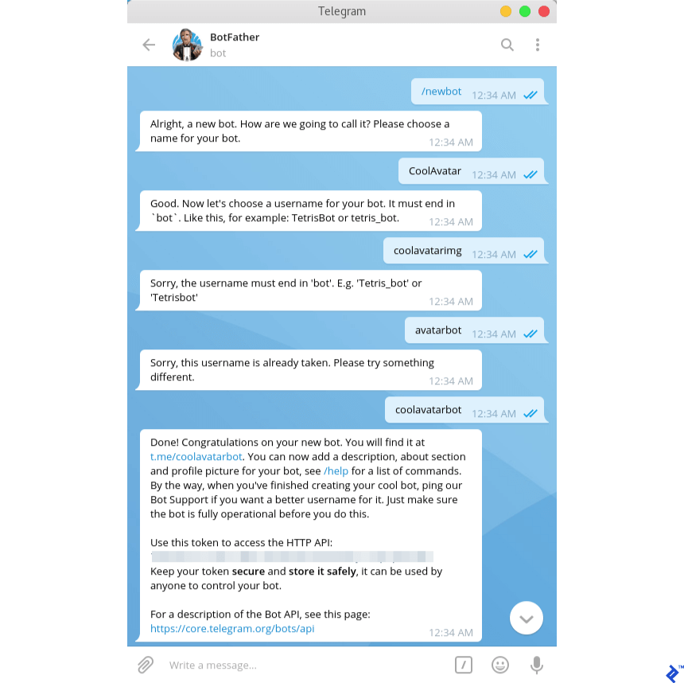
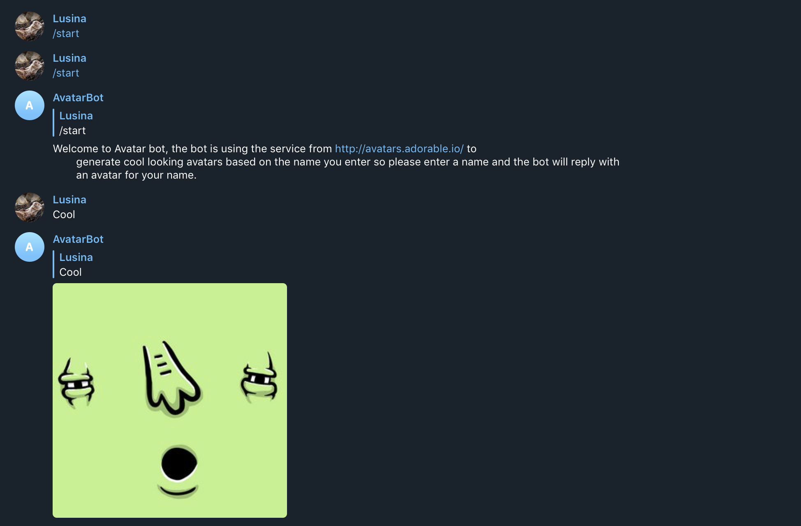

# Avatar Bot

[](https://travis-ci.org/BrianLusina/avatar-bot)
[](https://codecov.io/gh/BrianLusina/avatar-bot)

Simple Telegram Bot that sends you avatar images based on simple words you send it. The images are pulled from [Adorable Avatars](http://avatars.adorable.io/)

## Getting Started

These instructions will get you a copy of the project up and running on your local machine for development and testing 
purposes. 
See [deployment](./README.md#Deployment) for notes on how to deploy the project on a live system.


### Pre-requisites

Any editor of your choice can be used for this application.

1. [Python](https://www.python.org)

   This project has been built with Python 3.7. Ensure that you install this version of Python as outlined in the 
   link provided [here](https://www.python.org/downloads/)

2. [Pip](https://pip.pypa.io/en/stable/)
    
   This is a package manager for Python applications and will be useful when handling dependencies
   for this application. Installations instructions can be found in the link int the title.

3. [Pipenv](https://pipenv.readthedocs.io/en/latest/)

   An awesome dependency management tool for Python and is highly recommended. This is the preferred 
   tool of choice for this project. This allows use to separate between dev dependencies and dependencies
    
4. [Docker](https://www.docker.com/)
    
   This will be used when containerizing the application for running in a SOA(Service Oriented Architecture). This is
   used especially when deployment. Allows this application to run in any environment with minimal configuration.

### Installing

To get up and running you will need to do the following:

1. _Install dependencies_
   
   Install required dependencies of this project using pipenv, which is the required dependency management tool
   for this project. to install dependencies, simply use command in your terminal at the root of the project:
   
   ```bash
   pipenv install
   ```
   
   > This will automatically create a virtual environment for you and give further instructions on how to activate it

2. _Configure environment variables for the project_.
   
   This application has been structured in order to be portable. For this to happen, environment variables are used for some
   configuration settings. Example is a database connection. This is left to the user to setup database connection string
   in order not to be tied to a specific database. Another example is the port. A reasonable default is used, however, if 
   this default does not suit your needs, a PORT environment variable can be used. 
   
   In order to achieve this, create a `.env` file at the root of the project ad add these environment variables:
   
   ```.dotenv
   TOKEN=<TELEGRAM_BOT_TOKEN>
   URL=<URL>
   PORT=7000
   FLASK_ENV=development
   ``` 
   > These environment variables can then be passed on to the application. Note that the strings in <> are place holders
   > and are used to demonstrate where the values will go for the environment variables
   
   i. __Telegram Bot Token__
    
    To get this token, you will need a Telegram account, which you can sign up [here](https://telegram.org/). To create a chat
    bot on Telegram, you will need to contact the [BotFather](https://telegram.me/BotFather). The command you need is `/newbot`:
    
    
    > a sample chat with the BotFather
    
    It will give you more instructions on how to setup your bot. Once the bot is setup, you will see a token (which is hashed out
    in the image above). That is the token you will use for the bot and set in the `TOKEN` environment variable
    
   ii. __Hosting URL__
     
    Once the application is hosted(You can choose whichever platform to host it), you will need to setup the webhook 
    for Telegram to post your messages to. Get the URL that the application will be exposed to and add it as an environment
    variable (URL=<URL_THAT_IS_EXPOSED_BY_THE_HOSTING_PLATFORM_YOU_PICK>) 
    
    Next, will be to setup the Webhook by running the command:
    
    ``` bash
    python manage.py setup_webhook
    ```  
   
   iii. __Flask Environment__
    
    The FLASK_ENV environment variable determines the configuration to use. Various configurations are found [here](./app/config.py)
    For local development, you can use `development`, for production, it is advised to use `production`

This is a sample conversion with the resulting bot:




### Testing

The application tests can be found under [tests](./tests) directory and are structure in a similar manner to the application
code.

Test framework used is [Pytest](https://pytest.org/) and can be used as follows:

```bash
pytest
```
> This will discover all tests under [tests](./tests) directory

In case of running a coverage report simply use:

```bash
pytest --cov=app tests/
```
> Will run a coverage report using the plugin [pytest-cov](https://github.com/pytest-dev/pytest-cov)

To generate a test report run

```bash
coverage html
```
> This will generate a HTML file report that will be stored under coverage directory(This is not pushed to a VCS)

Settings and configuration for [coverage](https://coverage.readthedocs.io) can be found in the file [.coveragerc](./.coveragerc)

## Deployment

Deployment can be done on any hosting platform that supports running a Python application. In this case, [Heroku](https://www.heroku.com/) has been used.
However, any other hosting platform can be used. This goes as far as setting up a [Dockerfile](./Dockerfile) for those wishing
to deploy this as a micro-service in a larger Service Oriented Architecture.

## Built With

1. [Python](https://www.python.org/) - Source language
2. [Pytest](https://pytest.org/) - Python Test Framework
3. [Flask](http://flask.pocoo.org/) - Python Web Framework

## Contributing

Please read [contributing guide](./.github/CONTRIBUTING.md) for more information

## Versioning

We use [SemVer](https://semver) for versioning.